# PetFlow — Database ERD

```mermaid
erDiagram

    TENANT ||--o{ BRANCH : has
    TENANT ||--o{ USER : has
    TENANT ||--o{ CUSTOMER : owns
    TENANT ||--o{ SERVICE : configures
    TENANT ||--o{ PRODUCT : owns
    TENANT ||--o{ SUBSCRIPTION : has

    BRANCH ||--o{ USER_BRANCH : allows
    USER ||--o{ USER_BRANCH : belongs

    CUSTOMER ||--o{ PET : owns
    CUSTOMER ||--o{ APPOINTMENT : books
    PET ||--o{ APPOINTMENT : has

    SERVICE ||--o{ APPOINTMENT : selected
    USER ||--o{ APPOINTMENT : assigned
    BRANCH ||--o{ APPOINTMENT : hosts

    PET ||--o{ PET_NOTE : has
    PET ||--o{ PET_MEDICAL_RECORD : has
    PET ||--o{ PET_VACCINATION : receives
    PET ||--o{ GROOMING_PROFILE : has

    APPOINTMENT ||--o| GROOMING_QUEUE_ITEM : becomes
    GROOMING_QUEUE_ITEM }o--|| USER : groomer

    APPOINTMENT ||--o{ CLINIC_VISIT : may_create
    CLINIC_VISIT ||--o{ PRESCRIPTION : has
    CLINIC_VISIT ||--o{ TREATMENT : has
    CLINIC_VISIT ||--o{ PET_VACCINATION : records

    INVOICE ||--|{ INVOICE_ITEM : contains
    INVOICE ||--o{ PAYMENT : paid_by
    CUSTOMER ||--o{ INVOICE : billed
    PET ||--o{ INVOICE : related_to

    PRODUCT ||--o{ INVENTORY_TRANSACTION : moves
    BRANCH ||--o{ INVENTORY_TRANSACTION : occurs_at
    SUPPLIER ||--o{ PURCHASE : supplies
    PURCHASE ||--o{ PURCHASE_ITEM : contains
    PRODUCT ||--o{ PURCHASE_ITEM : purchased

    USER ||--o{ STAFF_COMMISSION : earns
    INVOICE ||--o{ STAFF_COMMISSION : generates

    CUSTOMER ||--o{ CUSTOMER_TAG : tagged
    TAG ||--o{ CUSTOMER_TAG : applies

    CUSTOMER ||--o{ CONSENT : grants

    CUSTOMER ||--o{ NOTIFICATION : receives
    APPOINTMENT ||--o{ NOTIFICATION : triggers
    CAMPAIGN ||--o{ CAMPAIGN_RECIPIENT : targets
    CUSTOMER ||--o{ CAMPAIGN_RECIPIENT : receives

    TENANT ||--o{ AUDIT_LOG : records
    USER ||--o{ AUDIT_LOG : performs

    TENANT {
      uuid id PK
      string name
      enum business_type
      string phone
      string email
      string timezone
      datetime created_at
    }

    BRANCH {
      uuid id PK
      uuid tenant_id FK
      string name
      string address
      string phone
      boolean active
    }

    USER {
      uuid id PK
      uuid tenant_id FK
      string email
      string password_hash
      string first_name
      string last_name
      enum status
    }

    USER_BRANCH {
      uuid user_id FK
      uuid branch_id FK
    }

    CUSTOMER {
      uuid id PK
      uuid tenant_id FK
      string first_name
      string last_name
      string phone
      string email
      string line_user_id
      string marketing_status
      datetime created_at
    }

    PET {
      uuid id PK
      uuid tenant_id FK
      uuid customer_id FK
      string name
      enum species
      string breed
      enum sex
      date birth_date
      decimal weight
      string allergies
      string behavioral_notes
      string special_requirements
    }

    PET_NOTE {
      uuid id PK
      uuid pet_id FK
      uuid created_by FK
      string type
      text content
      datetime created_at
    }

    PET_MEDICAL_RECORD {
      uuid id PK
      uuid pet_id FK
      uuid clinic_visit_id FK
      string record_type
      text content
      datetime created_at
    }

    GROOMING_PROFILE {
      uuid id PK
      uuid pet_id FK
      string preferred_cut
      string shampoo
      text warnings
      text notes
    }

    SERVICE {
      uuid id PK
      uuid tenant_id FK
      uuid branch_id FK
      string name
      string category
      int duration_minutes
      bigint base_price_minor
      boolean active
    }

    APPOINTMENT {
      uuid id PK
      uuid tenant_id FK
      uuid branch_id FK
      uuid customer_id FK
      uuid pet_id FK
      uuid service_id FK
      uuid staff_id FK
      datetime start_at
      datetime end_at
      enum status
      string source
      text notes
    }

    GROOMING_QUEUE_ITEM {
      uuid id PK
      uuid tenant_id FK
      uuid branch_id FK
      uuid appointment_id FK
      uuid groomer_id FK
      enum status
      datetime started_at
      datetime expected_finish_at
      datetime ready_at
    }

    CLINIC_VISIT {
      uuid id PK
      uuid tenant_id FK
      uuid branch_id FK
      uuid pet_id FK
      uuid veterinarian_id FK
      decimal weight
      decimal temperature
      text subjective
      text objective
      text assessment
      text plan
      datetime visited_at
    }

    PRESCRIPTION {
      uuid id PK
      uuid clinic_visit_id FK
      string medication_name
      string strength
      string route
      string frequency
      string duration
      decimal quantity
      text instruction
    }

    TREATMENT {
      uuid id PK
      uuid clinic_visit_id FK
      string name
      text notes
      bigint price_minor
    }

    PET_VACCINATION {
      uuid id PK
      uuid pet_id FK
      uuid clinic_visit_id FK
      string vaccine_name
      string lot_number
      date administered_at
      date next_due_at
    }

    INVOICE {
      uuid id PK
      uuid tenant_id FK
      uuid branch_id FK
      uuid customer_id FK
      uuid pet_id FK
      string invoice_no
      enum status
      bigint subtotal_minor
      bigint discount_minor
      bigint tax_minor
      bigint total_minor
      datetime issued_at
    }

    INVOICE_ITEM {
      uuid id PK
      uuid invoice_id FK
      uuid service_id FK
      uuid product_id FK
      string description
      decimal quantity
      bigint unit_price_minor
      bigint total_minor
    }

    PAYMENT {
      uuid id PK
      uuid invoice_id FK
      string method
      bigint amount_minor
      string reference
      datetime paid_at
    }

    PRODUCT {
      uuid id PK
      uuid tenant_id FK
      string sku
      string name
      string category
      bigint cost_minor
      bigint sale_price_minor
      int reorder_point
      boolean active
    }

    INVENTORY_TRANSACTION {
      uuid id PK
      uuid tenant_id FK
      uuid branch_id FK
      uuid product_id FK
      string type
      decimal quantity
      string reference_type
      uuid reference_id
      datetime created_at
    }

    SUPPLIER {
      uuid id PK
      uuid tenant_id FK
      string name
      string phone
      string email
    }

    PURCHASE {
      uuid id PK
      uuid tenant_id FK
      uuid branch_id FK
      uuid supplier_id FK
      string status
      bigint total_minor
      datetime purchased_at
    }

    PURCHASE_ITEM {
      uuid id PK
      uuid purchase_id FK
      uuid product_id FK
      decimal quantity
      bigint unit_cost_minor
      bigint total_minor
    }

    STAFF_COMMISSION {
      uuid id PK
      uuid tenant_id FK
      uuid user_id FK
      uuid invoice_id FK
      string basis
      decimal rate
      bigint amount_minor
    }

    TAG {
      uuid id PK
      uuid tenant_id FK
      string name
    }

    CUSTOMER_TAG {
      uuid customer_id FK
      uuid tag_id FK
    }

    CONSENT {
      uuid id PK
      uuid tenant_id FK
      uuid customer_id FK
      string consent_type
      boolean granted
      datetime recorded_at
    }

    NOTIFICATION {
      uuid id PK
      uuid tenant_id FK
      uuid customer_id FK
      uuid appointment_id FK
      string channel
      string type
      string status
      datetime scheduled_at
      datetime sent_at
    }

    CAMPAIGN {
      uuid id PK
      uuid tenant_id FK
      string name
      string channel
      string status
      datetime scheduled_at
    }

    CAMPAIGN_RECIPIENT {
      uuid id PK
      uuid campaign_id FK
      uuid customer_id FK
      string status
      datetime sent_at
    }

    SUBSCRIPTION {
      uuid id PK
      uuid tenant_id FK
      string plan_code
      string status
      datetime current_period_start
      datetime current_period_end
    }

    AUDIT_LOG {
      uuid id PK
      uuid tenant_id FK
      uuid user_id FK
      string action
      string entity
      uuid entity_id
      json old_data
      json new_data
      string ip
      datetime created_at
    }
```



## Modeling rules

### Primary keys

Use UUIDs.

### Tenant keys

All tenant-owned entities must include:

```text
tenant_id
```

### Money

Use integer minor units:

```text
price_minor
total_minor
amount_minor
```

For Thailand:

```text
100 baht = 10000 satang
```

Do not use float for money.

### Audit

Do not hard delete:

- invoices
- payments
- inventory transactions
- clinical records

Use status/void/archive workflows.

### Indexes

At minimum index:

```text
(tenant_id)
(tenant_id, branch_id)
(tenant_id, phone)
(tenant_id, created_at)
(tenant_id, status)
(customer_id)
(pet_id)
(start_at)
```

For appointments, optimize:

```text
tenant_id
branch_id
staff_id
start_at
end_at
status
```

### Uniqueness

Recommended:

```text
tenant + customer phone
tenant + product sku
tenant + invoice number
tenant + service name
```

Do not assume customer phone is globally unique across tenants.

---

# Suggested Prisma model grouping

Keep `schema.prisma` grouped by domain:

1. Tenant
2. Identity
3. CRM
4. Scheduling
5. Grooming
6. Clinic
7. Billing
8. Inventory
9. CRM automation
10. SaaS
11. Audit
